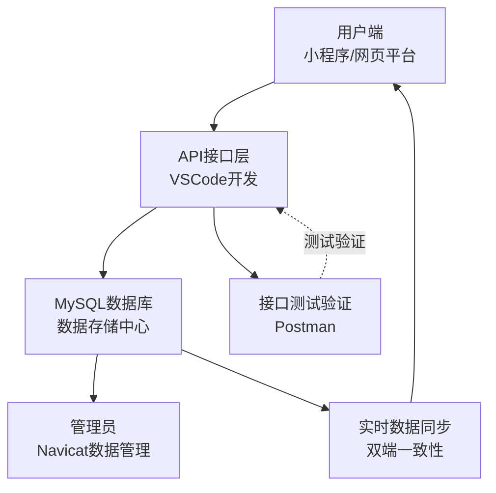

```mermaid
graph TD
    A[用户端<br/>小程序/网页平台] --> B[API接口层<br/>VSCode开发]
    B --> C[MySQL数据库<br/>数据存储中心]
    
    C --> D[管理员<br/>Navicat数据管理]
    C --> E[实时数据同步<br/>双端一致性]
    B --> F[接口测试验证<br/>Postman]
    
    E --> A
    F -.->|测试验证| B
    
  
  
```